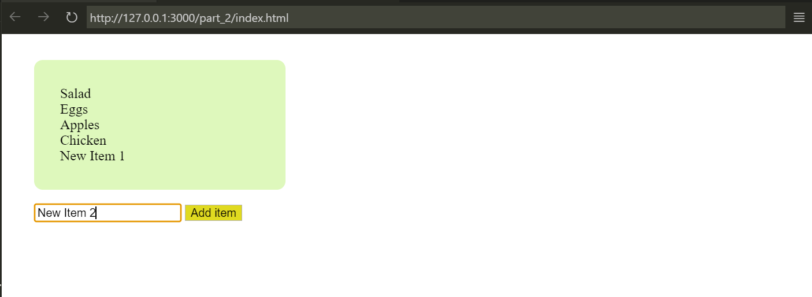

# web602-hw-w5d2

## Part 1: Lifecycle Hooks Demo using CodePen

Link to CodePen collection: [https://codepen.io/collection/mrazdG?sort_by=id](https://codepen.io/collection/mrazdG?sort_by=id)

## Part 2: Code Completion

In 3 different ways, implement the function to add item to the shop list.

- Method 1: add the event listener in `<script>`.
- Method 2: use the same event listener, but using Vue's `mounted` lifecycle hook.
- Method 3: use directives, such as `v-model` and `v-on:click`, to make the code simpler.
